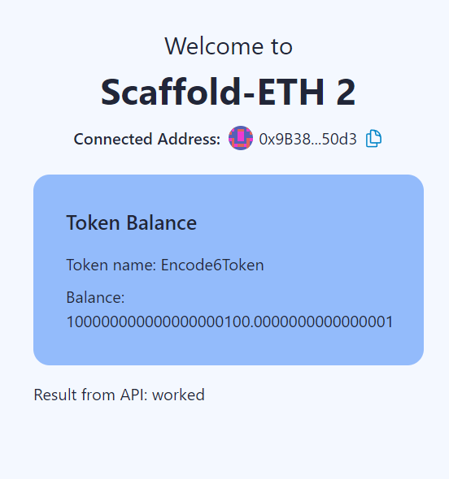
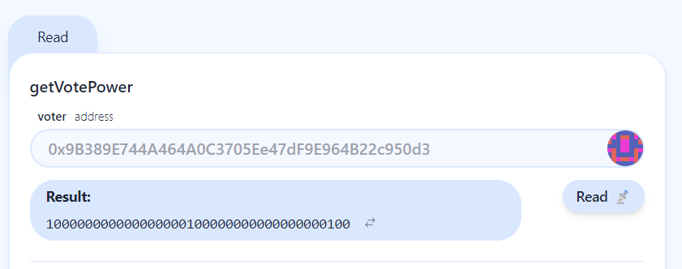
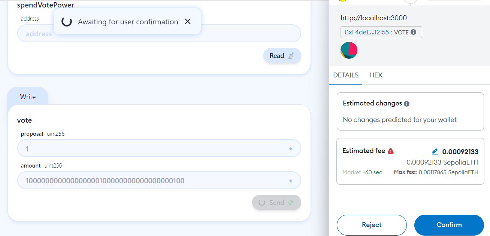
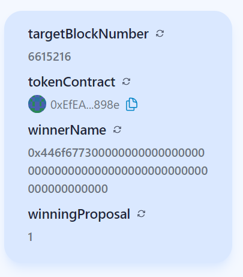
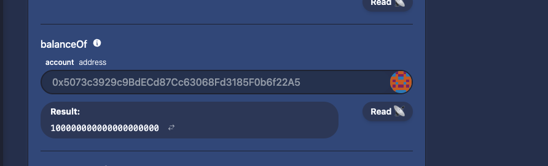
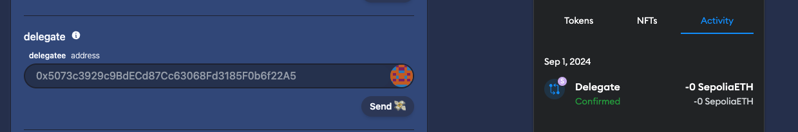
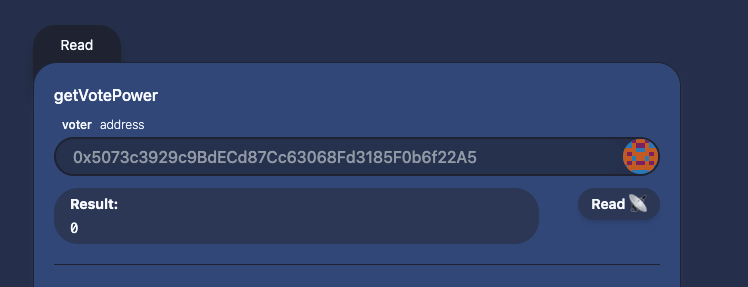

# @ErZeTe / Rama's interaction

1. deploy the contract
2. setup the backend and frontend
3. Mint the the token from API and airdrop to all the members wallet

4. Delegate my wallet and wait untill the block reach 6615216 to vote
5. Check my voting power after target block reached 
6. Vote all my voting power to proposal number 1, 
txHash: 0x929438e0ae9e3ab4ff41d474218f494f26578a8e6a59e58de396140e0ba57282 
7. Check that the winning proposal has change to number 1 (from number 0) 
8. Deployed the frontend to Vercel -> https://encode8ballot.vercel.app/

# @0xOwenn / gavin owen interaction

9. Check the token balance which was airdroped by 'ErZeTe' 
10. Delegate to yourself 
11. Check if you have voting power, but voting power is 0 because i delegate myself after the block reach 6615216 which was the final block to delegate 
